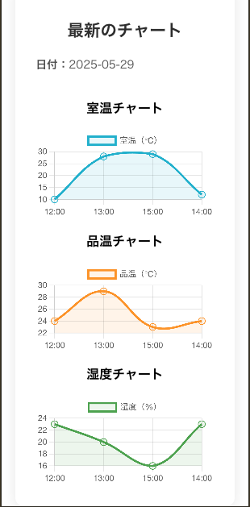
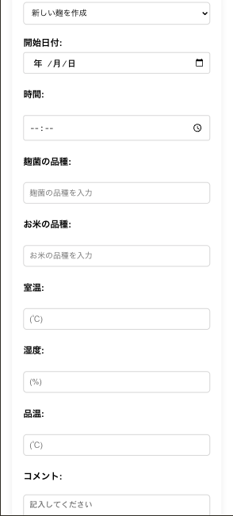
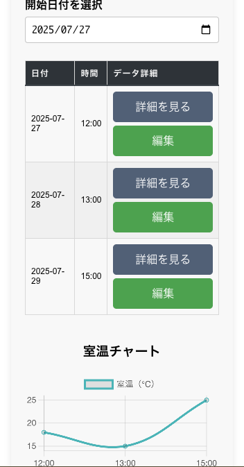

# 麹管理アプリ

## 概要

麹管理アプリは、米麹作りをサポートするためのデジタル管理ツールです。麹の育成プロセスを科学的にアプローチし、温度や湿度などの環境データを記録・管理することで、安定した品質の麹作りを実現します。

URL：```http://kojiapp.s3-website-ap-northeast-1.amazonaws.com/s```

## アプリイメージ
#### チャート一覧
<p align="center">
  
</p>

#### 入力項目
<p align="center">
  
</p>

#### 過去履歴検索
<p align="center">
  
</p>

## 背景

### 麹作りの重要性

麹は日本の発酵食品文化の基盤となる重要な微生物です。味噌、醤油、日本酒、甘酒など、私たちの食生活に欠かせない多くの食品が麹菌（Aspergillus oryzae）の力によって作られています。

### 麹育成の課題

麹の育成には以下のような課題があります：

- **温度管理の重要性**: 麹菌は温度に非常に敏感で、適切な温度範囲（28-32°C）を維持する必要があります
- **湿度管理**: 麹菌の成長には適切な湿度（60-70%）が必要です
- **時間管理**: 麹作りは通常3日間のプロセスで、各段階で異なる管理が必要です
- **記録の重要性**: 成功パターンを再現するため、詳細な記録が必要です
- **経験への依存**: 従来は職人の経験と勘に頼る部分が多く、初心者には難しい分野でした

### このアプリが解決すること

麹管理アプリは、これらの課題を以下のように解決します：

1. **デジタル記録**: 温度、湿度、時間を正確に記録し、データとして蓄積
2. **パターン分析**: 過去の成功例を分析し、最適な育成条件を特定
3. **アラート機能**: 適切でない環境条件を検知し、タイムリーに通知
4. **知識の共有**: 経験やノウハウをデジタル化し、誰でもアクセス可能に
5. **品質の安定化**: データに基づく管理により、安定した品質の麹作りを実現

## 主な機能

### 🌡️ 環境モニタリング
- 温度・湿度の定期的な記録
- リアルタイムでの環境状況確認
- 適切でない環境条件のアラート

### 📊 データ分析
- 温度・湿度の推移グラフ表示
- 過去のサイクルとの比較分析
- 成功パターンの特定と可視化

### 📝 詳細記録
- 各段階での詳細なメモ記録
- 写真による視覚的な記録
- 使用した米の種類や量の記録

### 🔄 サイクル管理
- 3日間の麹作りサイクルの完全管理
- 各段階での作業リマインダー
- サイクル完了後の評価記録

### 📱 モバイル対応
- スマートフォンからの簡単記録
- 外出先からの状況確認
- 直感的で使いやすいインターフェース

## 対象ユーザー

### 初心者の方
- 麹作りを始めてみたい方
- 失敗を減らして確実に麹を作りたい方
- 科学的なアプローチで学びたい方

### 経験者の方
- 品質をさらに向上させたい方
- データに基づく改善を行いたい方
- 知識やノウハウを記録・共有したい方


## 麹作りの基本プロセス

### Day 1: 蒸米と種付け
- 米を蒸し、適切な温度まで冷却
- 麹菌（種麹）を均等に散布
- 初期温度と湿度の設定

### Day 2: 手入れ
- 麹菌の繁殖状況を確認
- 必要に応じて切り返し作業
- 温度と湿度の調整

### Day 3: 完成
- 麹の完成度を確認
- 最終的な品質評価
- 次回への改善点の記録

## 導入効果

### 品質の向上
- データに基づく管理により、安定した品質の麹を作成
- 失敗率の大幅な減少
- 麹の活性度や風味の向上

### 効率の向上
- 適切なタイミングでの作業実施
- 無駄な作業の削減
- 時間管理の最適化

### 知識の蓄積
- 成功パターンの文書化
- ノウハウの継承
- 継続的な改善サイクルの構築

## 技術仕様

本アプリケーションは以下の技術で構築されています：

- **フロントエンド**: React + TypeScript
- **バックエンド**: AWS Lambda (Python)
- **データベース**: Amazon DynamoDB
- **インフラ**: AWS (API Gateway, CloudWatch等)
- **デプロイ**: Terraform

詳細な技術仕様や開発者向け情報については、[DEVELOPMENT.md](DEVELOPMENT.md) をご参照ください。
